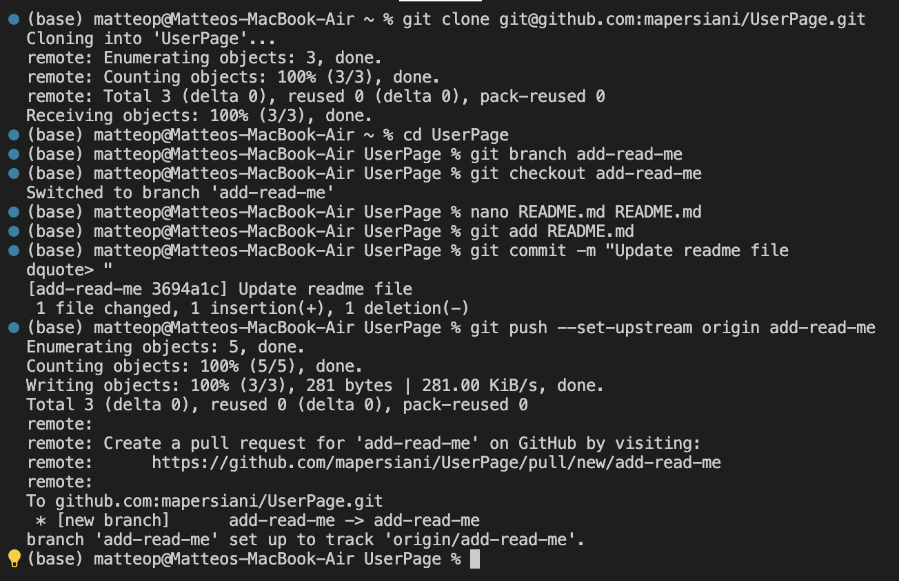
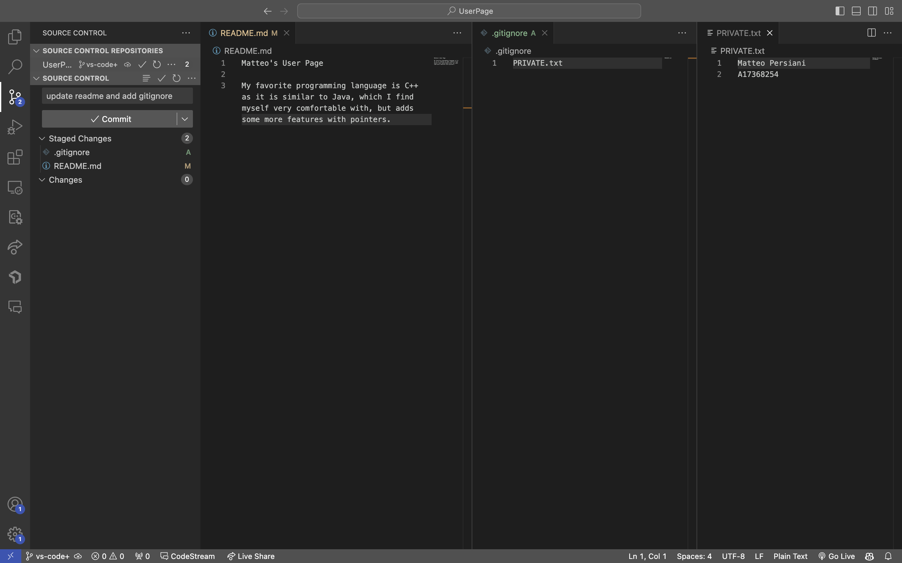

# Welcome to My User Page

Hello, I'm ***Matteo Persiani***, an aspiring computer engineer. I'm currently learning about software engineering in CSE 110!

## About Me

I'm studying Computer Engineering at Revelle College in UC San Diego, and my expected graduation date is June 2025. I've taken a heavier load each quarter, so I will graduate in just 3 years! I was born and raised in Sacramento, CA, and I'll be working my first summer internship as an Engineering Intern at Siemens Mobility in Sacramento. During this time, I'll have the opportunity to work with both their software and hardware teams to develop new skills and experiences. Besides school, some of my hobbies are soccer, rock climbing, traveling, and, newly, skateboarding. 

Here are my three favorite classes I've taken at UCSD:
- ECE 35
- ECE 176
- CSE 100

And favorite coding languages:
1. C++
2. Java
3. Python

Also, my favorite color is <span style="color: rgb(255, 120, 0);">orange</span>
## Lab 1

Here are a couple of images from my first Lab: 

### Terminal [1]
I mistyped one of the lines; it should have been:
```
git commit -m "Update readme file"
```


>I practiced using the terminal to clone a GitHub repo, create and use a new branch, edit a file, commit, and then push to GitHub.

### Visual Studio Code [2]


>I practiced using VSCode to add new files, use .gitignore, commit, and then push these changes to GitHub.

## Projects

- [X] [Landmark Classifier using different CNN networks](https://github.com/crae6/LandmarkClassifier) `python`
- [X] [Interactive Real-Time Audio Synthesizer](https://github.com/mapersiani/ECE45SynthEC) `python`
- [ ] Use an ESP32 to turn on the LED strip in my apartment for a few minutes at the push of a button. This will be useful if I have to go to the bathroom in the middle of the night but do not want to turn on bright lights. `C++`

## My GitHub Page

I already have a GitHub page set up as my work-in-progress [portfolio](https://mapersiani.github.io/home/). It contains links to my resume, LinkedIn, and more! 

## Conclusion

Images found on the page can be accessed here: 
- [[1]](Screenshots/terminal.png)
- [[2]](Screenshots/vscode.png) 
